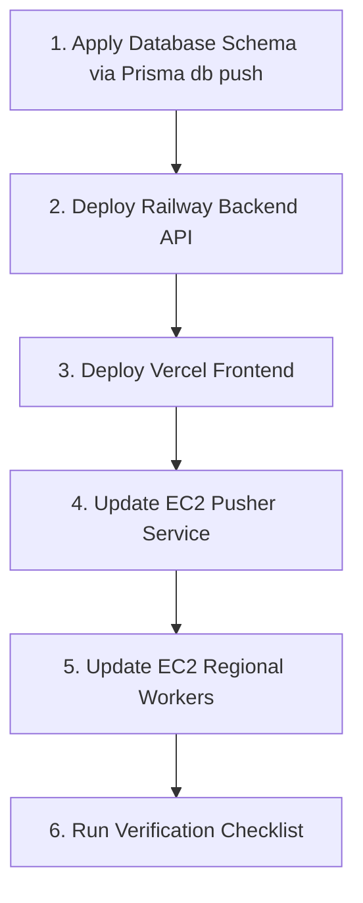

# Upgrid — Production Migration & OAuth Implementation Guide

This guide provides the exact step-by-step procedure to safely roll out all recent updates (configurable intervals, dynamic region filtering, regional worker probe isolation, real telemetry calculations, and Google/GitHub OAuth authentication) to your **live production environment** without downtime or breaking existing user accounts.

---

## Table of Contents
1. [Overview of Changes Being Deployed](#1-overview-of-changes-being-deployed)
2. [Database Schema Sync & Prisma Migration](#2-database-schema-sync--prisma-migration)
3. [Setting Up Google OAuth in Production](#3-setting-up-google-oauth-in-production)
4. [Setting Up GitHub OAuth in Production](#4-setting-up-github-oauth-in-production)
5. [Environment Variables Matrix](#5-environment-variables-matrix)
6. [Step-by-Step Production Deployment Procedure](#6-step-by-step-production-deployment-procedure)
7. [Post-Deployment Verification & Smoke Testing Checklist](#7-post-deployment-verification--smoke-testing-checklist)
8. [Rollback & Contingency Plan](#8-rollback--contingency-plan)

---

## 1. Overview of Changes Being Deployed

| Component | Nature of Changes | Backward Compatibility |
| :--- | :--- | :--- |
| **Database (`packages/store`)** | Added `interval` & `lastProbedAt` to `Website`; added `Account`, `Session`, `VerificationToken` models for NextAuth; made `User.username` and `User.password` nullable. | 100% Non-destructive additive changes. Existing users and websites remain intact. |
| **Backend API (`apps/api`)** | Added `GET /regions` (queries database); handles `interval` and `regions` in `POST /website`; dual-token verification (`AUTH_SECRET` & `JWT_SECRET`). | Existing endpoints maintain identical response structures. |
| **Frontend Web (`apps/web`)** | NextAuth v5 integration with Google and GitHub buttons; dynamic region loading; real probe math calculation (removed mock sinusoidal generator). | Matches exact brutalist UI/UX and styling. |
| **Pusher (`apps/pusher`)** | Dynamic interval scheduler replaces hardcoded 2-minute loop; dispatches region metadata with probes. | Transparent to existing monitors. |
| **Workers (`apps/worker`)** | Evaluates region targets on each probe; skips probe and ACKs message if worker's region was not selected. | Workers only execute work designated for their active region. |

---

## 2. Database Schema Sync & Prisma Migration

Because the production database is already live on Neon PostgreSQL with existing monitor and user records, we use non-destructive synchronization.

### Step 2.1: Apply Schema Changes to Neon Database
To automatically sync your Neon database schema without dropping any data or encountering IPv6 network timeout issues with Prisma CLI on Windows, run the built-in database synchronization tool:

```bash
# Navigate to store package
cd packages/store

# Run the automated database synchronization tool
pnpm run db:sync
```

This command connects to your Neon PostgreSQL database over TLS and safely executes:
- Creates `Account`, `Session`, and `VerificationToken` tables for NextAuth.
- Adds `interval` and `lastProbedAt` columns to `Website`.
- Makes `User.username` and `User.password` nullable while adding `name`, `email`, `emailVerified`, and `image` columns.
- Creates `_RegionToWebsite` join table for dynamic multi-region routing.
- Validates all 9 synchronized database tables.

Alternatively, if using standard Prisma CLI:
```bash
pnpm prisma db push
```


### Step 2.2: Generate Prisma Clients across Monorepo
Generate the updated Prisma clients across all packages:

```bash
# Root directory
cd ../..

# Generate clients for both store and web packages
pnpm --filter store prisma generate
pnpm --filter web prisma generate
```

### Step 2.3: Verify Existing Database Regions
Verify that the `Region` table contains the active monitoring regions matching your worker deployment:

```sql
-- Run in Neon SQL Editor or psql:
SELECT id, name FROM "Region";

-- If regions do not exist yet, insert them:
INSERT INTO "Region" ("id", "name")
VALUES 
  ('a1b2c3d4-e5f6-7890-abcd-111111111111', 'India'),
  ('a1b2c3d4-e5f6-7890-abcd-222222222222', 'US')
ON CONFLICT ("name") DO NOTHING;
```

---

## 3. Setting Up Google OAuth in Production

Follow these exact steps in the Google Cloud Console to create credentials:

### Step 3.1: Create/Select Google Cloud Project
1. Go to [Google Cloud Console](https://console.cloud.google.com/).
2. Select an existing project or click **New Project** (e.g. `Upgrid-Production`).

### Step 3.2: Configure OAuth Consent Screen
1. Go to **APIs & Services** → **OAuth consent screen**.
2. Select User Type: **External** and click **Create**.
3. Fill in the mandatory app information:
   - **App name**: `Upgrid`
   - **User support email**: Your support or admin email.
   - **App logo**: (Optional)
   - **App domain**: `https://your-upgrid-domain.com` (or `https://your-project.vercel.app`)
   - **Developer contact information**: Your email address.
4. Click **Save and Continue**.
5. **Scopes**: Add standard scopes: `.../auth/userinfo.email`, `.../auth/userinfo.profile`, `openid`. Click **Save and Continue**.
6. **Publish App**: Once ready, click **Publish App** to switch from "Testing" to "In Production" (otherwise signin will be restricted to test users).

### Step 3.3: Create OAuth 2.0 Client ID
1. Navigate to **APIs & Services** → **Credentials**.
2. Click **+ CREATE CREDENTIALS** → **OAuth client ID**.
3. Set **Application type**: `Web application`.
4. Set **Name**: `Upgrid Web Production`.
5. Under **Authorized JavaScript origins**, click **+ ADD URI**:
   - `https://your-upgrid-domain.com` (replace with your actual production domain)
   - *(Optional for preview/testing)*: `http://localhost:3000`
6. Under **Authorized redirect URIs**, click **+ ADD URI**:
   - `https://your-upgrid-domain.com/api/auth/callback/google`
   - *(Optional for preview/testing)*: `http://localhost:3000/api/auth/callback/google`
7. Click **CREATE**.
8. Copy the **Client ID** and **Client Secret**.
   - Store as `AUTH_GOOGLE_ID`
   - Store as `AUTH_GOOGLE_SECRET`

---

## 4. Setting Up GitHub OAuth in Production

Follow these steps in GitHub to register your production OAuth Application:

### Step 4.1: Register New GitHub OAuth App
1. Go to [GitHub Developer Settings](https://github.com/settings/developers).
2. Click **OAuth Apps** → **New OAuth App** (or **Register a new application**).
3. Fill in the application details:
   - **Application name**: `Upgrid`
   - **Homepage URL**: `https://your-upgrid-domain.com`
   - **Application description**: `Distributed Uptime & Latency Monitoring Platform`
   - **Authorization callback URL**: `https://your-upgrid-domain.com/api/auth/callback/github`
4. Click **Register application**.

### Step 4.2: Generate Client Secret
1. On the newly created application page, copy the **Client ID**.
   - Store as `AUTH_GITHUB_ID`
2. Under **Client secrets**, click **Generate a new client secret**.
3. Copy the generated secret immediately (GitHub won't show it again).
   - Store as `AUTH_GITHUB_SECRET`

---

## 5. Environment Variables Matrix

### Generate `AUTH_SECRET`
Generate a high-entropy 64-character secret for NextAuth JWT encryption:

```bash
# In your terminal:
openssl rand -base64 32
# Example output: v8hF0t2X+gB9w4QyZ3dJ6...
```

### Environment Configuration by Service

#### 1. Vercel (`apps/web` — Frontend)
Go to **Vercel Project** → **Settings** → **Environment Variables**:

| Variable | Recommended Value | Notes |
| :--- | :--- | :--- |
| `AUTH_SECRET` | `<generated-64-char-secret>` | Required for NextAuth encryption |
| `AUTH_GOOGLE_ID` | `<google-client-id>` | From Google Cloud Console |
| `AUTH_GOOGLE_SECRET` | `<google-client-secret>` | From Google Cloud Console |
| `AUTH_GITHUB_ID` | `<github-client-id>` | From GitHub Developer Settings |
| `AUTH_GITHUB_SECRET` | `<github-client-secret>` | From GitHub Developer Settings |
| `DATABASE_URL` | `postgresql://...sslmode=require` | Neon connection pooler URL |
| `NEXT_PUBLIC_API_URL` | `https://your-api-domain.up.railway.app` | Railway Express API public URL |

#### 2. Railway (`apps/api` — Backend API)
Go to **Railway Project** → **Service Settings** → **Variables**:

| Variable | Recommended Value | Notes |
| :--- | :--- | :--- |
| `DATABASE_URL` | `postgresql://...sslmode=require` | Neon connection pooler URL |
| `AUTH_SECRET` | `<same-secret-as-vercel>` | Validates OAuth tokens issued by NextAuth |
| `JWT_SECRET` | `<legacy-or-same-secret>` | Fallback secret for username/password signin |
| `CORS_ORIGIN` | `https://your-upgrid-domain.com` | Restricts access to Vercel domain |
| `NODE_ENV` | `production` | Production mode |
| `PORT` | `3003` | Express port |

#### 3. EC2 Pusher Instance (`apps/pusher`)
In `/home/ec2-user/.env.pusher`:

| Variable | Value |
| :--- | :--- |
| `DATABASE_URL` | `postgresql://...sslmode=require` |
| `REDIS_URL` | `rediss://your-valkey-endpoint:6379` |
| `PUSHER_INTERVAL_MS` | `10000` (or `30000`) |
| `PROBE_RETENTION_MS` | `900000` (15 minutes) |

#### 4. EC2 Regional Workers (`apps/worker`)
In `/home/ec2-user/.env.worker`:

| Variable | India Worker (`ap-south-1`) | US Worker (`us-east-1`) |
| :--- | :--- | :--- |
| `DATABASE_URL` | `postgresql://...sslmode=require` | `postgresql://...sslmode=require` |
| `REDIS_URL` | `rediss://your-valkey-endpoint:6379` | `rediss://your-valkey-endpoint:6379` |
| `REGION` | `india` | `us` |
| `REGION_ID` | `<uuid-of-india-region>` | `<uuid-of-us-region>` |
| `WORKER_ID` | `worker-in-01` | `worker-us-01` |

---

## 6. Step-by-Step Production Deployment Procedure

Follow these steps in exact order to guarantee zero-downtime deployment:



### Step 1: Database Migration
```bash
cd packages/store
pnpm prisma db push
```

### Step 2: Deploy Backend API on Railway
1. Push your updated code to your GitHub repository's production branch (`main`).
2. Railway will trigger the build automatically using:
   ```bash
   pnpm --filter store run build && pnpm --filter api run build
   ```
3. Confirm API logs:
   - `Swagger docs available at /api-docs`
   - Verify `GET https://your-api-domain.up.railway.app/regions` returns active regions JSON.

### Step 3: Deploy Frontend on Vercel
1. Set the 5 OAuth environment variables in Vercel.
2. Vercel triggers deployment using:
   ```bash
   pnpm turbo run build --filter=web
   ```
3. Ensure deployment completes successfully with all static and dynamic pages generated.

### Step 4: Rebuild & Restart Pusher Service (EC2)
On your Pusher EC2 instance:
```bash
# Pull new image or code
docker pull ghcr.io/<your-github-user>/upgrid-pusher:latest

# Restart container with updated scheduler
docker stop upgrid-pusher && docker rm upgrid-pusher
docker run -d \
  --name upgrid-pusher \
  --restart unless-stopped \
  --env-file ~/.env.pusher \
  ghcr.io/<your-github-user>/upgrid-pusher:latest

# Check logs
docker logs -f upgrid-pusher
```

### Step 5: Rebuild & Restart Regional Workers (EC2)
On each Worker EC2 instance:
```bash
# Pull new image or code
docker pull ghcr.io/<your-github-user>/upgrid-worker:latest

# Restart container
docker stop upgrid-worker && docker rm upgrid-worker
docker run -d \
  --name upgrid-worker \
  --restart unless-stopped \
  --env-file ~/.env.worker \
  ghcr.io/<your-github-user>/upgrid-worker:latest

# Check logs
docker logs -f upgrid-worker
```

---

## 7. Post-Deployment Verification & Smoke Testing Checklist

Run through this test suite immediately following deployment:

### Authentication Verification
- [ ] **Username/Password Login**: Existing users can sign in via `/signin` and access the dashboard.
- [ ] **Google OAuth Sign In**:
  1. Click **CONTINUE WITH GOOGLE** on `/signin`.
  2. Consent on Google OAuth screen.
  3. Automatically redirected to `/dashboard` with valid session and profile loaded.
- [ ] **Google OAuth Sign Up**:
  1. Click **REGISTER WITH GOOGLE** on `/signup`.
  2. Verify user record is created in Neon `User` and `Account` tables without password.
- [ ] **GitHub OAuth Sign In / Sign Up**:
  1. Click **CONTINUE WITH GITHUB** on `/signin`.
  2. Consent on GitHub OAuth screen.
  3. Redirected to `/dashboard` with session active.
- [ ] **Session Persistence**: Refresh the `/dashboard` page — verify session remains authenticated without logging out.
- [ ] **Logout Flow**: Click **LOGOUT** in sidebar — verify local tokens are wiped and user is redirected to `/signin`.
- [ ] **Protected Route Guard**: Try opening `https://your-upgrid-domain.com/dashboard` in an incognito window — verify immediate redirect to `/signin`.

### Monitoring & Telemetry Verification
- [ ] **Dynamic Regions in UI**: Click **+ ADD WEBSITE** on `/my-website`. Verify that only the 2 active database regions (e.g. `India` and `America`) appear in the selector (and `EU-WEST-1` is gone).
- [ ] **Configurable Interval**: Register a website with `30 SEC` or `1 MIN` interval. Verify that card header displays `30 SEC` / `1 MIN`.
- [ ] **Pusher Dispatch**: Pusher logs show checks dispatched based on the site's individual interval.
- [ ] **Regional Probe Filtering**:
  - Worker in India only probes when `India` is selected for that website.
  - Worker logs show `Skipping probe for unselected region` when website has not selected that region.
- [ ] **Real Metrics**: Detail view `/websites/[websiteId]` shows calculated uptime %, true average latency, and no fictitious sine-wave mock data.

---

## 8. Rollback & Contingency Plan

If an unexpected issue arises in production:
1. **Frontend**: In the Vercel dashboard, click **Deployments** → select the previous stable deployment → click **Instant Rollback**.
2. **Backend API**: In Railway dashboard, click **Deployments** → select the previous deployment → click **Rollback**.
3. **Database**: The database changes are completely non-destructive (adding optional columns and standalone OAuth tables), meaning older code will continue to operate normally without rolling back the database.
